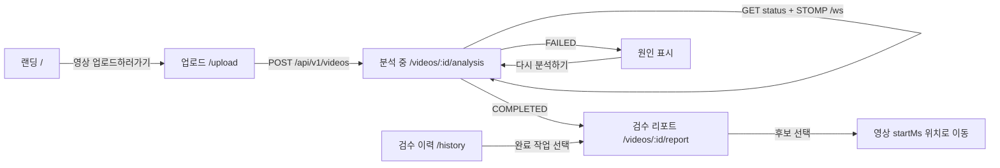

<div align="center">


# Creator Risk Manager

**업로드 전에, 다시 확인할 구간만 찾습니다.**

편집이 끝난 영상의 발언·화면 자막·화면 속 삽입 이미지를 살펴보고<br />
제작자가 직접 검토할 타임라인을 만드는 **React 19 + TypeScript MVP**입니다.

<p>
  <a href="#빠른-시작">빠른 시작</a> ·
  <a href="#화면">화면</a> ·
  <a href="#api-연결">API 연결</a> ·
  <a href="#검증">검증</a>
</p>


</div>

<br />

> OoPs!?는 논란 여부를 판정하거나 영상을 자동으로 고치지 않습니다.<br />
> 확인이 필요한 후보와 근거를 보여주고, 최종 판단은 제작자에게 남깁니다.

## 빠른 시작

```bash
git clone <repository-url>
cd CentralHackathon
npm install
npm run dev
```

| 주소 | 역할 |
| --- | --- |
| `http://localhost:5173` | Vite 프런트엔드 |
| `http://localhost:3001` | 디스크 저장형 Mock REST·STOMP 서버 |

`npm run dev`는 두 서버를 함께 실행하고, Vite 개발 서버는 `/api`와 `/ws` 요청을 Mock 서버로 프록시합니다.

### 개발용 옵션

```bash
# 분석 단계 전환 속도를 조절합니다.
MOCK_STEP_MS=300 npm run dev

# 첫 분석만 실패시켜 실패·재시도 흐름을 확인합니다.
MOCK_FAIL_FIRST_JOB=true npm run dev
```

업로드 파일과 작업 상태는 로컬 `mock-data/`에 저장됩니다. 이 디렉터리는 Git에 포함되지 않습니다.

## 화면

현재 구현은 OoPs!?의 화면 흐름과 최소 반응형 레이아웃을 기준으로 구성했습니다. API DTO는 `src/api`에서 관리하고, 화면은 훅과 프레젠테이션 컴포넌트로 분리해 실제 백엔드와 디자인이 바뀌어도 교체 범위를 작게 유지합니다.

### 랜딩

서비스가 무엇을 살펴보고 무엇을 판단하지 않는지 설명합니다. 화면의 업로드 CTA는 모두 영상 업로드 화면으로 이어집니다.

<p align="center">
  
</p>

### 업로드 · 빈 상태 · 설정

업로드는 `mp4`, `mov`, `avi`를 지원하며 화면에서 최대 500MB·최대 90분 정책을 안내합니다. 검수 리포트와 이력은 업로드 전 빈 상태를 제공하고, 설정 화면은 보관·결제·계정 정책을 안내합니다.

<table>
  <tr>
    <td width="50%"></td>
    <td width="50%"></td>
  </tr>
  <tr>
    <td align="center"><sub>영상 업로드</sub></td>
    <td align="center"><sub>설정 · 결제</sub></td>
  </tr>
  <tr>
    <td width="50%"></td>
    <td width="50%"></td>
  </tr>
  <tr>
    <td align="center"><sub>검수 리포트 빈 상태</sub></td>
    <td align="center"><sub>검수 이력 빈 상태</sub></td>
  </tr>
</table>

## 사용자 흐름



## 주요 경로

| 화면 | 경로 | 연결 지점 |
| --- | --- | --- |
| 랜딩 | `/` | API 없음 · 업로드 CTA 제공 |
| 영상 업로드 | `/upload` | `POST /api/v1/videos` |
| 분석 진행 | `/videos/:videoId/analysis` | `GET /status`, STOMP `/ws`, 3초 polling fallback |
| 검수 리포트 | `/videos/:videoId/report` | `GET /report`, Range 영상 스트림, 프레임 URL |
| 검수 완료 | `/videos/:videoId/completed` | 검수 요약, 타임코드 복사 |
| 검수 리포트 빈 상태 | `/report` | 업로드 유도 CTA |
| 검수 이력 | `/history` | `GET /api/v1/videos` |
| 설정 | `/settings` | 보관·결제·계정 안내 |

## API 연결

프런트의 모든 HTTP 요청은 [`src/api/client.ts`](src/api/client.ts)를 통과합니다. 실제 Spring 서버가 준비되면 화면 코드 수정 없이 서버 주소와 DTO 계약만 맞춰 환경변수를 교체할 수 있습니다.

```bash
VITE_API_BASE_URL=https://api.example.com \
VITE_WS_URL=wss://api.example.com/ws \
npm run dev
```

`VITE_API_BASE_URL`에는 `/api/v1`을 포함하지 않은 API 서버 주소를 입력합니다. 프런트가 `/api/v1` 경로를 붙여 요청합니다.

### 외부 API 계약

- 업로드: `POST /api/v1/videos` (`multipart/form-data`, `file`, optional `genre`)
- 상태: `GET /api/v1/videos/:videoId/status`
- 이력: `GET /api/v1/videos/history`
- 리포트: `GET /api/v1/videos/:videoId/report`
- 재시도: `POST /api/v1/videos/:videoId/analysis/retry`
- 영상: `GET /api/v1/videos/:videoId/stream` (`Range`, `206`, `416` 지원)
- 프레임: `GET /api/v1/videos/:videoId/frames/:frameId`
- 진행률: STOMP `/ws` 구독 `/topic/videos/:videoId/progress`

성공 응답은 `success / message / data`, 오류 응답은 `success / message / error.code / error.traceId` 구조를 사용합니다. 프런트는 `error.code`로 상태를 분기하고, `message`를 사용자에게 표시합니다.

리포트 이벤트는 `startMs`, `endMs`, `type`, `reason`, `frameUrl`을 기본으로 사용하며, 필요하면 `candidateType`, `references[]`, `coverage[]`, `warnings[]`를 함께 받을 수 있습니다.

> **Spring ↔ Python 참고**<br />
> 현재 프런트는 Spring의 외부 API만 호출합니다. Spring이 Python Worker와 통신하는 내부 방식은 프런트 계약에 포함하지 않으며, 실제 배포 시에도 `VITE_API_BASE_URL`과 `VITE_WS_URL`만 교체하는 것을 목표로 합니다.

### Vercel 배포 참고

Vercel 정적 배포에는 `server/index.ts`가 포함되지 않습니다. 배포 환경에서는 실제 API 서버 주소를 `VITE_API_BASE_URL`, `VITE_WS_URL`에 지정하고, API 서버에서 프런트 도메인의 CORS와 WebSocket origin을 허용해야 합니다.

## 프로젝트 구조

```text
.
├── src/
│   ├── api/                  # DTO 타입과 단일 API client
│   ├── components/           # 공통 shell, 상태 UI
│   ├── hooks/                # 업로드·진행률·리포트·재시도 상태
│   ├── styles/               # 공통·페이지별 CSS
│   ├── App.tsx               # 라우트와 화면 조합
│   └── assets/logo/          # OoPs!? 로고 SVG
├── server/index.ts           # 임시 REST + STOMP Mock 서버
├── scripts/contract-smoke.ts # 핵심 API 계약 스모크 테스트
├── assets/screenshots/       # README와 공유용 화면 캡처
└── mock-data/                # 로컬 업로드·상태 저장 (Git 제외)
```

## 검증

```bash
npm run typecheck
npm run typecheck:server
npm run test:contract
npm run build
git diff --check
```

Mock 서버와 계약 테스트는 업로드, 상태 전이, 첫 작업 실패·재시도, 리포트, 프레임, 영상 Range 응답, STOMP 진행률을 확인할 수 있도록 구성되어 있습니다.

## 현재 범위

포함: 업로드 전 검토 UI, 진행률 복구, polling fallback, 실패·재시도, 리포트 타임라인, 영상 seek, 참고 자료·부분 분석 경고, 검수 완료, 이력, 빈 상태, 반응형 최소 레이아웃.

제외: 인증, 사용자별 권한, 결제 연동, 실제 AI 분석, 외부 검색, Spring ↔ Python 내부 API, 결과 편집·다운로드, 서버 측 검수 액션 영구 저장.

<div align="center">

Made for creators who want one more honest look before publishing.

</div>
