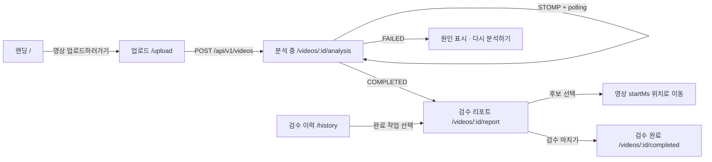

<div align="center">


# Creator Risk Manager

**업로드 전에, 다시 확인할 구간만 찾습니다.**

편집이 끝난 영상의 발언·화면 자막·화면 속 삽입 이미지를 살펴보고<br />
제작자가 직접 검토할 타임라인을 만드는 **React 19 + TypeScript MVP**입니다.

<p>
  <a href="#빠른-시작">빠른 시작</a> ·
  <a href="#화면">화면</a> ·
  <a href="#api-연결">API 연결</a> ·
  <a href="#검증">검증</a>
</p>


</div>

<br />

> OoPs!?는 논란 여부를 판정하거나 영상을 자동으로 고치지 않습니다.<br />
> 확인이 필요한 후보와 근거를 보여주고, 최종 판단은 제작자에게 남깁니다.

## 빠른 시작

```bash
git clone <repository-url>
cd CentralHackathon
npm install
npm run dev
```

| 주소 | 역할 |
| --- | --- |
| `http://localhost:5173` | Vite 프런트엔드 |
| `http://localhost:3001` | 디스크 저장형 Mock REST·STOMP 서버 |

`npm run dev`는 두 서버를 함께 실행하고, Vite 개발 서버는 `/api`와 `/ws` 요청을 Mock 서버로 프록시합니다.

### 개발용 옵션

```bash
# 분석 단계 전환 속도를 조절합니다.
MOCK_STEP_MS=300 npm run dev

# 첫 분석만 실패시켜 실패·재시도 흐름을 확인합니다.
MOCK_FAIL_FIRST_JOB=true npm run dev
```

업로드 파일과 작업 상태는 로컬 `mock-data/`에 저장됩니다. 이 디렉터리는 Git에 포함되지 않습니다.

## 화면

### 사용자 흐름



### 주요 경로

| 화면 | 경로 | 설명 |
| --- | --- | --- |
| 랜딩 | `/` | 서비스 소개 · 업로드 CTA |
| 영상 업로드 | `/upload` | mp4, mov, avi · 500MB · 90분 |
| 분석 진행 | `/videos/:videoId/analysis` | 5단계 진행률, STOMP 실시간 + 3초 polling fallback |
| 검수 리포트 | `/videos/:videoId/report` | 후보 카드, 영상 seek, 결정 저장 |
| 검수 완료 | `/videos/:videoId/completed` | 검수 요약, 타임코드 복사 |
| 검수 리포트 빈 상태 | `/report` | 업로드 유도 |
| 검수 이력 | `/history` | 전체/완료/실패 필터 |
| 설정 | `/settings` | 보관·결제·계정 안내 |

## 검토 후보 유형

검토 후보는 두 가지 유형으로 제공됩니다.

| 유형 | CandidateType | 표시 내용 |
| --- | --- | --- |
| **발언** | `SPEECH_REVIEW` | 실제 발언 + 앞뒤 맥락 (contextBefore/After) |
| **사실 확인** | `FACT_CHECK` | 발언 또는 화면 텍스트 + 참고 자료 링크 |

사실 확인은 `type` 필드로 소스를 구분합니다:
- `type: "SPEECH"` → STT 발언에서 발견
- `type: "CAPTION"` → OCR 화면 텍스트에서 발견

## API 연결

프런트의 모든 HTTP 요청은 [`src/api/client.ts`](src/api/client.ts)를 통과합니다. 실제 Spring 서버가 준비되면 화면 코드 수정 없이 환경변수만 교체합니다.

```bash
VITE_API_BASE_URL=https://api.example.com \
VITE_WS_URL=wss://api.example.com/ws \
npm run dev
```

### 외부 API 계약

| 메서드 | 경로 | 설명 |
| --- | --- | --- |
| `POST` | `/api/v1/videos` | 영상 업로드 (multipart/form-data, file, optional genre) |
| `GET` | `/api/v1/videos/:videoId/status` | 분석 상태 조회 |
| `GET` | `/api/v1/videos/history` | 검수 이력 (status, page, size) |
| `GET` | `/api/v1/videos/:videoId/report` | 검수 리포트 |
| `PUT` | `/api/v1/videos/:videoId/review-actions/:eventId` | 검수 결정 저장 |
| `POST` | `/api/v1/videos/:videoId/review-completion` | 검수 완료 |
| `POST` | `/api/v1/videos/:videoId/analysis/retry` | 실패 작업 재시도 |
| `POST` | `/api/v1/videos/:videoId/analysis/cancel` | 분석 취소 |
| `GET` | `/api/v1/videos/:videoId/stream` | 영상 Range 스트리밍 |
| `GET` | `/api/v1/videos/:videoId/frames/:frameId` | 대표 프레임 |
| STOMP | `/ws` → `/topic/videos/:videoId/progress` | 실시간 진행률 |

성공 응답은 `{ success, data, error: null }`, 오류 응답은 `{ success: false, data: null, error: { code, message, details } }` 구조입니다.

### Vercel 배포 참고

Vercel 정적 배포에는 `server/index.ts`가 포함되지 않습니다. 배포 환경에서는 실제 API 서버 주소를 `VITE_API_BASE_URL`, `VITE_WS_URL`에 지정하고, API 서버에서 프런트 도메인의 CORS와 WebSocket origin을 허용해야 합니다.

## 프로젝트 구조

```text
.
├── src/
│   ├── api/                  # DTO 타입(types.ts)과 API client(client.ts)
│   ├── components/           # AppShell, LandingKicker 등 공유 컴포넌트
│   ├── hooks/                # 업로드·진행률·리포트·재시도 상태 훅
│   ├── pages/                # 페이지별 컴포넌트 (8개)
│   ├── utils/                # formatTime, reportEventKind 등 유틸리티
│   ├── styles/               # base + 페이지별 CSS
│   ├── App.tsx               # 라우터
│   └── assets/logo/          # OoPs!? 로고 SVG
├── server/index.ts           # Mock REST + STOMP 서버
├── scripts/
│   ├── dev.mjs              # 개발 서버 동시 실행
│   └── contract-smoke.ts    # API 계약 스모크 테스트
├── assets/screenshots/       # README용 화면 캡처
└── mock-data/                # 로컬 업로드·상태 저장 (Git 제외)
```

## 검증

```bash
npm run typecheck          # 프런트엔드 타입 검사
npm run typecheck:server   # 서버 타입 검사
npm run test:contract      # API 계약 스모크 테스트
npm run build              # 프로덕션 빌드
```

## 현재 범위

**포함:** 업로드 검토 UI, 진행률 복구, polling fallback, 실패·재시도·취소, 검수 리포트(발언/사실확인 2유형), 영상 seek, 참고 자료 링크, 앞뒤 맥락, 검수 완료, 이력, 빈 상태, 반응형 레이아웃.

**제외:** 인증, 사용자별 권한, 결제 연동, 실제 AI 분석, 외부 검색, Spring ↔ Python 내부 API, 결과 편집·다운로드, 영상 제목·채널 URL 메타데이터, severity/riskTypes 화면 표시.

<div align="center">

Made for creators who want one more honest look before publishing.

</div>
