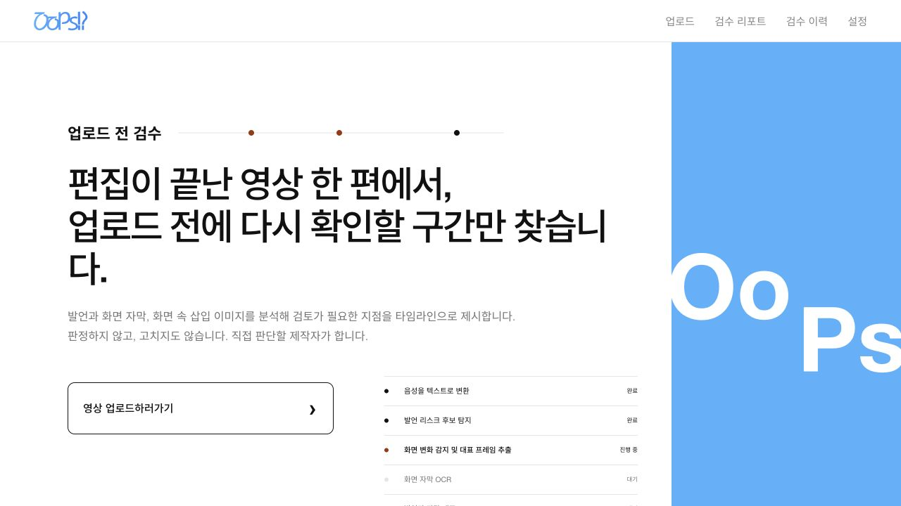
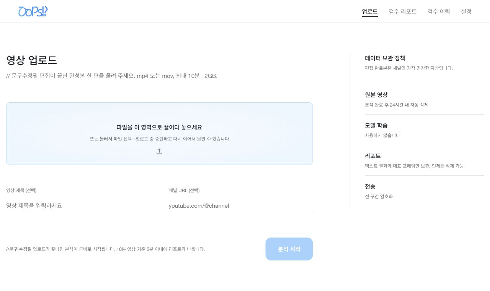
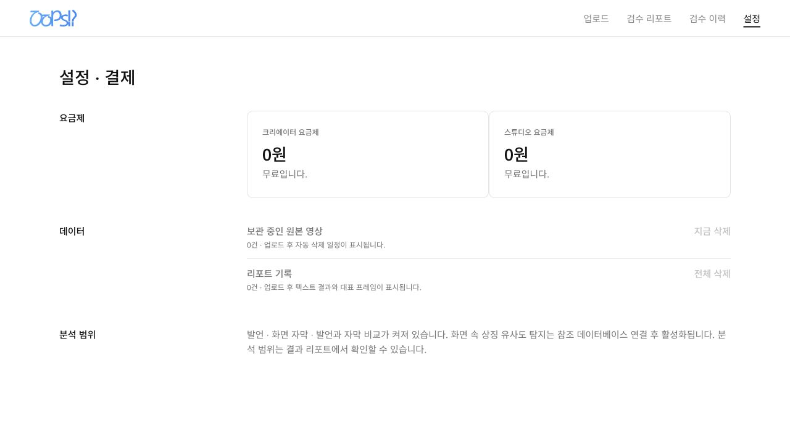
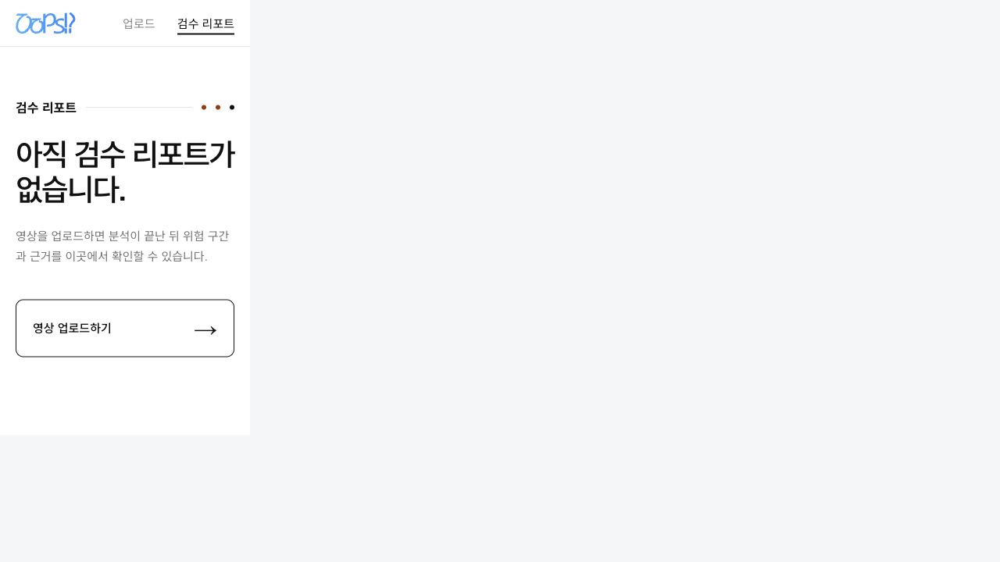
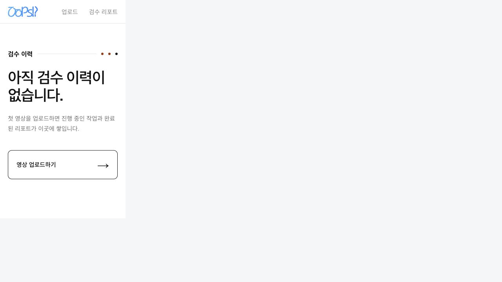
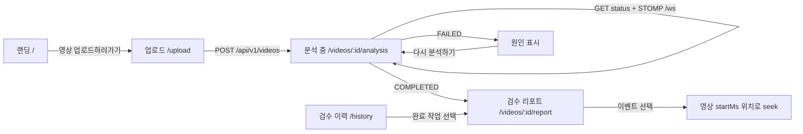

<div align="center">


# Creator Risk Manager

**업로드 전에, 다시 확인할 구간만 찾습니다.**

편집이 끝난 영상의 발언·화면 자막·화면 속 삽입 이미지를 분석해<br />
제작자가 직접 검토할 타임라인을 만드는 **React 19 + TypeScript MVP**입니다.

<p>
  <a href="#빠른-시작">빠른 시작</a> ·
  <a href="#화면">화면</a> ·
  <a href="#api-연결">API 연결</a> ·
  <a href="#검증">검증</a>
</p>


</div>

<br />

> OoPs!?는 논란 여부를 판정하거나 영상을 자동으로 고치지 않습니다.<br />
> 근거가 보이는 검토 후보를 제시하고, 최종 판단은 제작자에게 남깁니다.

## 빠른 시작

```bash
git clone <repository-url>
cd CentralHackathon
npm install
npm run dev
```

| 주소 | 역할 |
| --- | --- |
| `http://localhost:5173` | Vite 프런트엔드 |
| `http://localhost:3001` | 디스크 저장형 Mock REST/STOMP 서버 |

`npm run dev`가 두 서버를 함께 실행하고, Vite가 `/api`와 `/ws`를 Mock 서버로 프록시합니다.

### 개발용 옵션

```bash
# 분석 단계 전환 속도 조절
MOCK_STEP_MS=300 npm run dev

# 첫 작업만 실패시켜 실패·재시도 화면 확인
MOCK_FAIL_FIRST_JOB=true npm run dev
```

업로드 파일과 작업 상태는 `mock-data/`에 저장됩니다. 이 디렉터리는 Git에 포함되지 않습니다.

## 화면

현재 구현은 Figma 화면을 기준으로 고정한 최소 프레젠테이션 계층입니다.<br />
서버 DTO는 API 훅에서 화면용 상태로 변환되고, 실제 디자인이 도착하면 CSS와 프레젠테이션 컴포넌트만 교체할 수 있습니다.

디자인 기준: [OoPs!? Figma 파일](https://www.figma.com/design/Zm5hPAQ7ujUmt5HRpxS9ZW/OoPs-?node-id=0-1&t=ywsrVSnoqyNMAk84-1)

### 랜딩

서비스가 무엇을 보고 무엇을 보지 않는지 설명하고, 두 CTA 모두 업로드 화면으로 연결됩니다.

<p align="center">
  
</p>

### 업로드 · 빈 상태 · 설정

<table>
  <tr>
    <td width="50%"></td>
    <td width="50%"></td>
  </tr>
  <tr>
    <td align="center"><sub>영상 업로드</sub></td>
    <td align="center"><sub>설정 · 결제</sub></td>
  </tr>
  <tr>
    <td width="50%"></td>
    <td width="50%"></td>
  </tr>
  <tr>
    <td align="center"><sub>검수 리포트 빈 상태</sub></td>
    <td align="center"><sub>검수 이력 빈 상태</sub></td>
  </tr>
</table>

## 사용자 흐름



## 주요 경로

| 화면 | 경로 | 연결 지점 |
| --- | --- | --- |
| 랜딩 | `/` | API 없음 · 업로드 CTA만 제공 |
| 영상 업로드 | `/upload` | `POST /api/v1/videos` |
| 분석 진행 | `/videos/:videoId/analysis` | `GET /status`, STOMP `/ws`, 3초 polling fallback |
| 검수 리포트 | `/videos/:videoId/report` | `GET /report`, Range 영상 스트림, 프레임 URL |
| 검수 리포트 빈 상태 | `/report` | 업로드 유도 CTA |
| 검수 이력 | `/history` | `GET /api/v1/videos` |
| 설정 · 결제 | `/settings` | MVP에서는 안내 화면만 제공 |

## API 연결

프런트의 모든 HTTP 요청은 [`src/api/client.ts`](src/api/client.ts)를 통과합니다.<br />
실제 Spring 서버가 준비되면 코드 수정 없이 주소와 계약만 맞춰 환경변수를 바꿉니다.

```bash
VITE_API_BASE_URL=https://api.example.com \
VITE_WS_URL=wss://api.example.com/ws \
npm run dev
```

필수 계약은 다음과 같습니다.

- REST base path: `/api/v1`
- WebSocket endpoint: `/ws`
- 업로드: `POST /videos` (`mp4`, `mov`, `avi`, 최대 500MB)
- 상태: `GET /videos/:id/status`
- 리포트: `GET /videos/:id/report`
- 재시도: `POST /videos/:id/analysis/retry`
- 영상: `GET /videos/:id/stream` (`Range`, `206`, `416` 지원)
- 진행률: STOMP `/topic/videos/:id/progress`

> **Vercel 배포 참고**<br />
> Vercel 정적 배포에는 `server/index.ts`가 포함되지 않습니다. 배포 환경에서는 `VITE_API_BASE_URL`과 `VITE_WS_URL`을 실제 API 서버로 지정하고, API 서버에서 프런트 도메인 CORS와 WebSocket origin을 허용해야 합니다. 주소를 지정하지 않은 정적 데모에서는 이력 화면이 연결 안내가 포함된 빈 상태로 표시됩니다.

## 프로젝트 구조

```text
.
├── src/
│   ├── api/                 # DTO 타입과 단일 API client
│   ├── components/          # 공통 shell, 상태 UI
│   ├── hooks/               # 업로드·진행률·리포트·재시도 상태
│   ├── App.tsx              # 라우트와 화면 조합
│   ├── style.css            # Figma 기준 토큰·반응형 스타일
│   └── assets/logo/         # OoPs!? 로고 SVG
├── server/index.ts          # 임시 REST + STOMP Mock 서버
├── scripts/contract-smoke.ts # 핵심 API 계약 스모크 테스트
├── assets/screenshots/      # README와 공유용 화면 캡처
└── mock-data/               # 로컬 업로드·상태 저장 (Git 제외)
```

## 검증

```bash
npm run typecheck
npm run typecheck:server
npm run test:contract
npm run build
git diff --check
```

Mock 서버는 업로드, 상태 전이, 첫 작업 실패/재시도, 리포트, 프레임, 영상 Range 스트리밍, STOMP 진행률을 제공합니다.

## 현재 범위

포함: 업로드 전 검토 UI, 진행률 복구, polling fallback, 실패·재시도, 리포트 타임라인, 영상 seek, 빈 상태, 반응형 최소 레이아웃.

제외: 인증, 사용자별 영상 목록 권한, 결제 연동, 결과 편집·다운로드, 실제 AI 분석, Spring ↔ Python 내부 API.

<div align="center">

Made for creators who want one more honest look before publishing.

</div>
