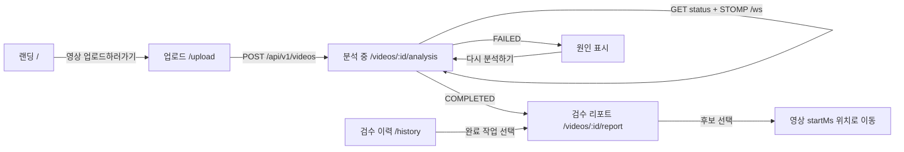

<div align="center">


# Creator Risk Manager

**업로드 전에, 다시 확인할 구간만 찾습니다.**

편집이 끝난 영상의 발언과 화면을 살펴보고,<br />
제작자가 직접 검토할 타임라인을 만드는 **React 19 · TypeScript MVP**입니다.

<p>
  <a href="#빠른-시작">빠른 시작</a> ·
  <a href="#제품-경험">제품 경험</a> ·
  <a href="#api-연결">API 연결</a> ·
  <a href="#검증">검증</a>
</p>


</div>

<br />

> OoPs!?는 논란 여부를 판정하거나 영상을 자동으로 고치지 않습니다.<br />
> 확인이 필요한 후보와 근거를 보여주고, 최종 판단은 제작자에게 남깁니다.

## 프로젝트 소개

영상은 완성된 뒤에도 한 번 더 확인할 순간이 있습니다. 발언과 자막의 강도가 달라지거나, 화면 속 문구가 의도보다 세게 전달되거나, 맥락을 더 확인해야 하는 장면이 생길 수 있습니다.

Creator Risk Manager는 영상을 업로드하면 음성·화면 텍스트·장면 정보를 바탕으로 검토 후보를 시간순으로 정리합니다. 제작자는 해당 시점의 영상을 바로 확인하고, 수정·확인·보류를 선택할 수 있습니다.

### 우리가 지키는 원칙

- 자동 판정 대신 **검토 후보와 근거**를 제공합니다.
- 이벤트의 시간 정보를 기준으로 원본 영상의 해당 위치까지 이동합니다.
- 분석이 일부 완료되지 않은 경우에도 결과와 경고를 구분해 보여줍니다.
- 원본 영상과 분석 결과의 보관 정책을 명확하게 안내합니다.

## 제품 경험

### 1. 랜딩

서비스가 어떤 정보를 확인하고 어떤 판단을 하지 않는지 설명합니다. 두 개의 업로드 CTA는 모두 영상 업로드 화면으로 이어집니다.

<p align="center">
  
</p>

### 2. 업로드

`mp4`, `mov`, `avi` 파일을 업로드할 수 있습니다. 현재 화면은 최대 500MB·최대 90분 정책을 안내하며, 파일을 끌어놓거나 선택하는 방식을 지원합니다.

### 3. 분석 진행

업로드 직후 `PENDING` 상태로 작업이 생성됩니다. 분석 화면은 먼저 REST 상태를 복구한 뒤 STOMP 진행률을 구독하고, 연결이 끊기면 3초 간격 polling으로 전환합니다. 새로고침하거나 화면을 닫아도 작업 상태를 다시 확인할 수 있습니다.

### 4. 검수 리포트

완료된 분석은 타임라인 후보로 표시됩니다. 후보를 선택하면 영상이 `startMs / 1000` 위치로 이동하고, 필요하면 대표 프레임·참고 자료·부분 분석 경고를 함께 확인할 수 있습니다.

### 5. 검수 완료와 이력

검수 후보를 모두 확인한 뒤 완료 화면으로 이동합니다. 검수 이력에서는 업로드한 영상의 상태, 진행률, 후보 수를 확인할 수 있으며, 아직 영상이 없을 때는 업로드 화면으로 안내합니다.

## 사용자 흐름



## 빠른 시작

```bash
git clone <repository-url>
cd CentralHackathon
npm install
npm run dev
```

개발 서버가 실행되면 다음 주소를 사용할 수 있습니다.

| 주소 | 역할 |
| --- | --- |
| `http://localhost:5173` | Vite 프런트엔드 |
| `http://localhost:3001` | 디스크 저장형 Mock REST·STOMP 서버 |

`npm run dev`는 프런트엔드와 Mock 서버를 함께 실행합니다. Vite 개발 서버는 `/api`와 `/ws` 요청을 Mock 서버로 프록시합니다.

### Mock 서버 옵션

```bash
# 분석 단계 전환을 빠르게 확인
MOCK_STEP_MS=300 npm run dev

# 첫 분석만 실패시켜 실패·재시도 흐름 확인
MOCK_FAIL_FIRST_JOB=true npm run dev
```

업로드 파일과 작업 상태는 로컬 `mock-data/`에 저장됩니다. 해당 디렉터리는 Git에 포함되지 않습니다.

## 화면과 라우트

| 화면 | 경로 | 주요 동작 |
| --- | --- | --- |
| 랜딩 | `/` | 서비스 소개, 업로드 CTA |
| 영상 업로드 | `/upload` | 파일 선택·업로드, 형식·크기 정책 안내 |
| 분석 진행 | `/videos/:videoId/analysis` | 상태 복구, STOMP 진행률, polling fallback, 재시도 |
| 검수 리포트 | `/videos/:videoId/report` | 타임라인, 영상 seek, 참고 자료, 검수 액션 |
| 검수 완료 | `/videos/:videoId/completed` | 검수 요약, 타임코드 복사, 다음 작업 안내 |
| 검수 리포트 빈 상태 | `/report` | 업로드 유도 화면 |
| 검수 이력 | `/history` | 전체·완료·실패 건수와 영상별 상태 |
| 설정 | `/settings` | 보관·결제·계정 정책 안내 |

## API 연결

프런트의 HTTP 요청은 모두 [`src/api/client.ts`](src/api/client.ts)를 거칩니다. 서버 주소를 환경변수로 지정하면 화면 컴포넌트의 수정 없이 실제 Spring API로 교체할 수 있습니다.

```bash
VITE_API_BASE_URL=https://api.example.com \
VITE_WS_URL=wss://api.example.com/ws \
npm run dev
```

`VITE_API_BASE_URL`에는 `/api/v1`을 포함하지 않은 API 서버 주소를 입력합니다. 프런트가 `/api/v1` 경로를 붙여 요청합니다.

### 외부 API 계약

| 기능 | 요청 |
| --- | --- |
| 업로드 | `POST /api/v1/videos` · `multipart/form-data` · `file`, optional `genre` |
| 상태 조회 | `GET /api/v1/videos/:videoId/status` |
| 검수 이력 | `GET /api/v1/videos` |
| 리포트 | `GET /api/v1/videos/:videoId/report` |
| 재시도 | `POST /api/v1/videos/:videoId/analysis/retry` |
| 영상 재생 | `GET /api/v1/videos/:videoId/stream` · HTTP Range |
| 프레임 | `GET /api/v1/videos/:videoId/frames/:frameId` |
| 진행률 | STOMP `/ws` 구독 `/topic/videos/:videoId/progress` |

성공 응답은 `success / message / data`, 오류 응답은 `success / message / error.code / error.traceId` 구조를 사용합니다. 프런트는 `error.code`로 상태를 분기하고, `message`를 사용자에게 표시합니다.

리포트 이벤트는 `startMs`, `endMs`, `type`, `reason`, `frameUrl`을 기본으로 사용하며, 필요에 따라 `candidateType`, `references[]`, `coverage[]`, `warnings[]`를 받을 수 있습니다.

### WebSocket 동작

- 구독 경로: `/topic/videos/:videoId/progress`
- `jobId`가 현재 분석 작업과 다르면 오래된 메시지를 무시합니다.
- 연결이 실패하거나 끊기면 3초 polling으로 상태를 확인합니다.
- `COMPLETED` 수신 시 리포트로 이동하고, `FAILED` 수신 시 원인과 재시도 버튼을 표시합니다.

### Vercel 배포 참고

Vercel의 정적 배포에는 `server/index.ts`가 포함되지 않습니다. 배포 시 실제 API 서버의 주소를 `VITE_API_BASE_URL`, `VITE_WS_URL`에 지정하고, 백엔드에서 프런트 도메인의 CORS와 WebSocket origin을 허용해야 합니다.

## 프로젝트 구조

```text
.
├── src/
│   ├── api/                  # API DTO와 단일 API client
│   ├── components/           # 공통 shell과 상태 UI
│   ├── hooks/                # 업로드·진행률·리포트·재시도 상태
│   ├── styles/               # 공통·페이지별 CSS
│   ├── App.tsx               # 라우트와 화면 조합
│   └── assets/logo/          # OoPs!? 로고 SVG
├── server/index.ts           # 임시 REST + STOMP Mock 서버
├── scripts/contract-smoke.ts # 핵심 API 계약 스모크 테스트
├── assets/screenshots/       # README용 화면 캡처
└── mock-data/                # 로컬 업로드·상태 저장 (Git 제외)
```

## 검증

```bash
npm run typecheck
npm run typecheck:server
npm run test:contract
npm run build
git diff --check
```

계약 스모크 테스트는 업로드, 이력 조회, 상태 전이, 완료 리포트, 영상 Range 응답을 확인합니다. Mock 서버는 첫 작업 실패와 재시도, 프레임 응답, STOMP 진행률도 제공합니다.

## 현재 범위

### 포함

- 업로드 전 검토 안내와 최소 반응형 UI
- 파일 업로드와 분석 상태 복구
- STOMP 진행률 및 polling fallback
- 분석 실패·재시도 흐름
- 리포트 타임라인과 영상 위치 이동
- 참고 자료·부분 분석 경고 표시
- 검수 완료 화면과 검수 이력
- 디스크 저장형 Mock REST·STOMP 서버

### 아직 포함하지 않는 것

- 인증과 사용자별 권한
- 결제·플랜 변경의 실제 처리
- 실제 AI 분석 및 외부 검색
- Spring ↔ Python 내부 API 구현
- 결과 편집·다운로드
- 서버 측 검수 액션 영구 저장

## 다음 단계

실제 백엔드가 준비되면 프런트는 다음 순서로 연결합니다.

1. Spring API와 `VITE_API_BASE_URL`, `VITE_WS_URL`을 연결합니다.
2. Swagger/OpenAPI 응답이 본 README의 외부 DTO 계약과 일치하는지 확인합니다.
3. CORS, WebSocket origin, Range 스트리밍을 배포 환경에서 검증합니다.
4. 실제 영상으로 업로드부터 검수 완료까지 브라우저 E2E를 실행합니다.

<div align="center">

Made for creators who want one more honest look before publishing.

</div>
